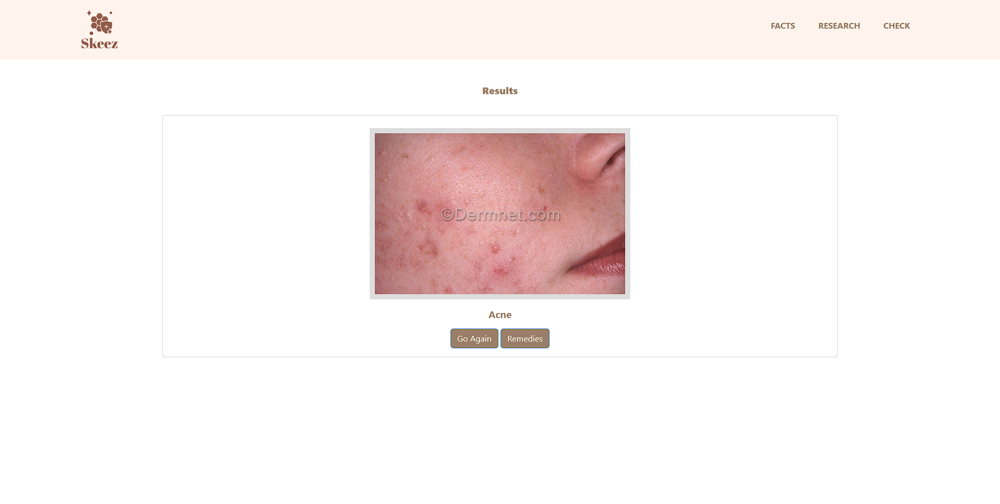
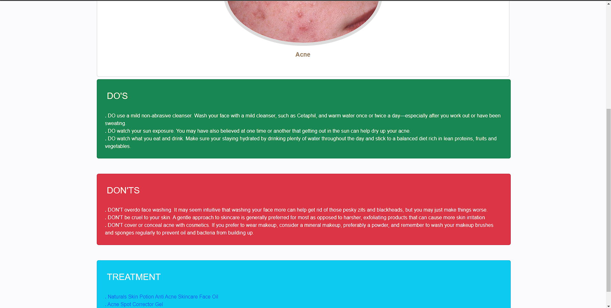

# Skin Disease Analyzer
It analyzes images to detect possible skin diseases. It works on deep learning neural networking model. 

## Start the app in Docker
>Step 1 - Download the code from the GH repository (using `GIT`)

```
$ # Get the code
$ git clone https://github.com/CosmicPegasus07/Skin-Disease-Analyzer.git
$ cd Skin-Disease-Analyzer

```
>Step 2 - Build the `docker image`

`$ docker build -t skin:latest .`

Note: If on Windows use the `wsl` command in terminal to enter commands. The shell file won't work in non-wsl environment.

>Step 4 - Create a writeable container layer over the specified image, and then start it.

`$ docker run --name skin -d -p 8000:5000 --rm skin:latest`

Visit http://localhost:8000 in your browser. The app should be up & running.

>Stop the container/process.

`$ docker stop <container ID>`

## Working images

### Home Page 


### Selection Page


### Results Page



### Remedies Page


